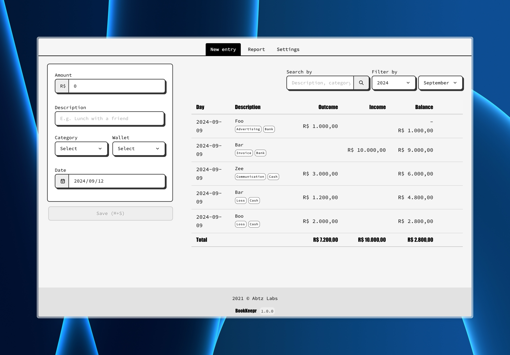

# BookKeepr

by [Rogerio Taques](https://x.com/rogeriotaques).

BookKeepr - _/ˈbo͝o(k)ˌkēpər/_ - is a macOS bookkeeping app for small businesses and self-employed professionals in Japan. Designed to be simple and easy.



Supports both `single-entry` and `double-entry` methods.

## What is bookkeeping?

It is the recording of financial transactions, and is part of the process of accounting in business and other organizations. It involves preparing source documents for all transactions, operations, and other events of a business.

Transactions include purchases, sales, receipts and payments by an individual person or an organization/corporation. There are several standard methods of bookkeeping, including the single-entry and double-entry bookkeeping systems.

While these may be viewed as "real" bookkeeping, any process for recording financial transactions is a bookkeeping process.

Source: [Wikipedia](https://en.wikipedia.org/wiki/Bookkeeping).

## Get started

### Running locally (development)

Once this repository is cloned, open a terminal window and go to the project folder.

#### Run the backend (api) with:

```sh
$ cd api
$ yarn install
$ yarn start
```

#### Run the frontend (app) with:

```sh
$ cd app
$ yarn install
$ yarn start
```

Next, open your preferred browser and visit to `http://localhost:5173` and happy coding 🤘

### Running the Docker image locally

First, build the image:

```sh
$ docker build -t abtzco/bookkeepr .
```

Then, run the image:

```sh
$ docker run --name bookkeepr -p 8090:8083 -v /tmp/bookkeepr:/bookkeeper/api/data abtzco/bookkeepr:latest
```

> [!NOTE]
> All the data will be stored in `/tmp/bookkeepr` folder in your local machine.

### Running the Docker image in `PRODUCTION `

Once you SSH into the server, run the following command to download the image:

```sh
$ docker pull abtzco/bookkeepr:latest
```

Remove any existing container:

```sh
$ docker rm -f bookkeepr
```

Then, run the image:

```sh
$ docker run -d --restart unless-stopped --name bookkeepr -p 80:8083 -v /home/<USER>/bookkeepr/data:/bookkeeper/api/data abtzco/bookkeepr:latest
```

> [!NOTE]
> Adjust the host port number accordingly. All the data will be stored in `/home/<USER>/bookkeepr/data` folder in your server.

#### Troubleshooting

If you run into problems related to `sqlite3` and `node-gyp` while running `yarn install` or `yarn start`, try to downgrade `sqlite` to `^5.0.0` and install `node-gyp` globally with:

```sh
$ npm install -g node-gyp
```

### Tech stack

- Node 20.17+
- Vue 3.4+
- SQLite

## Questions?

Have a question or need some help? <br>
Drop me a line on [Twitter](https://twitter.com/rogeriotaques).

## Bug reports and contributions

Please report bugs [here](https://github.com/rogeriotaques/bookkeepr/issues). 🙇‍♂️

Contributions are very welcome as pull requests. 🙏
